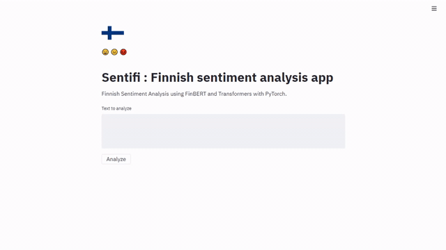

# Finnish Sentiment Analysis with BERT and Transformers using PyTorch.
The project contains two ways to perform sentiment analysis, via REST API or via a web app.
First, download the trained model from my Drive by running the follwowing command:

```
python bin/download_model.py
```
then install the necessary requirements:
```
pip install -r requirements.txt
```

## Inference using API
The classifier is doplyed as an API which is built using FastApi and Uvicorn. to give a try, run ;

```
uvicorn sentifi.api:app
```

## Try it out using a Streamlit app
The classifier can be test by interacting with a simple app built using Streamlit:



```
streamlit run sentifi/app.py
```

#### Using Docker
Build the app image

```
docker build -f Dockerfile -t app:latest .
```

then run the container

```
docker run -p 8501:8501 app:latest
```

***

Special Thanks to :
* TurkuNLP team for the [FinBERT](https://github.com/TurkuNLP/FinBERT) trained model.
* [Venelin Valkov](https://github.com/curiousily) for the amazing BERT tutorials.
